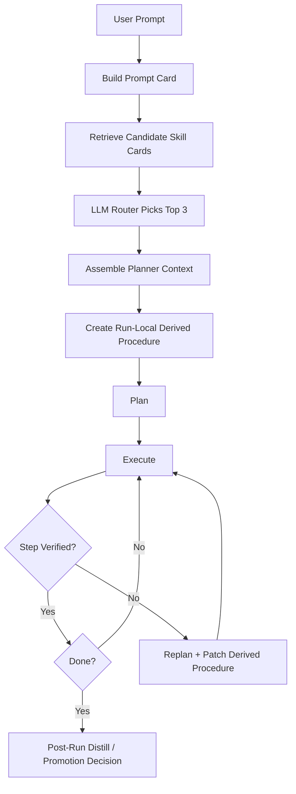
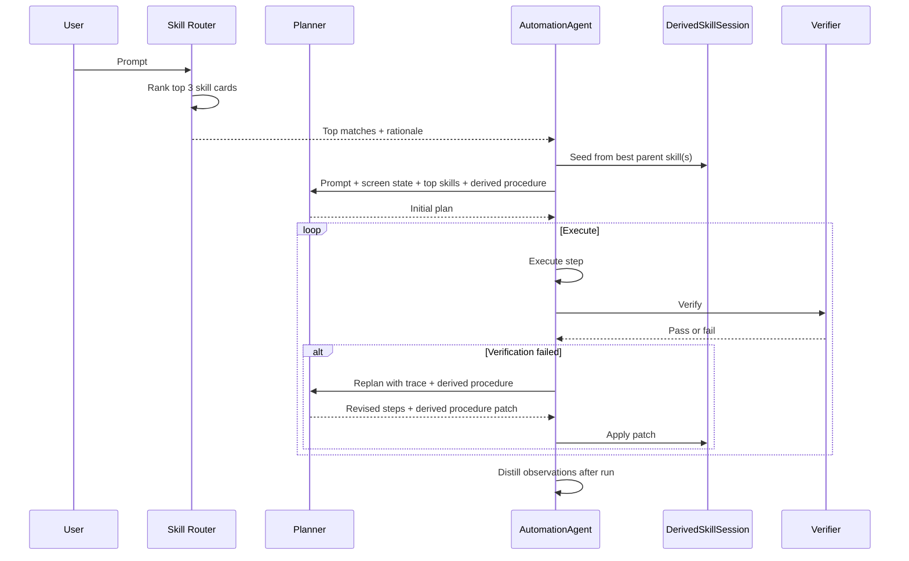
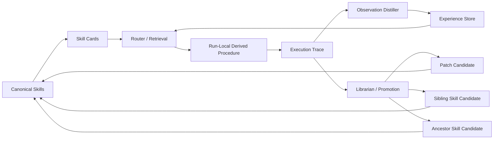

# Adaptive Skill System

## Purpose

Design a skill system that:

- scales to a large skill library
- minimizes unnecessary replanning during rollout
- reuses existing skills by analogy
- learns from execution traces over time
- lets LLMs do most of the semantic work
- keeps canonical skills stable and human-readable

This document is grounded in the current codebase:

- `src/automation_agent/skills/registry.py`
- `src/automation_agent/skills/router.py`
- `src/automation_agent/skills/distiller.py`
- `src/automation_agent/skills/experience.py`
- `src/automation_agent/orchestrator/agent.py`

## Audience

This document is written primarily for an AI agent implementing the system, with diagrams included for human review.

Read it this way:

- the numbered flows and invariants are implementation guidance
- the examples and diagrams are explanatory aids
- if the document says the system "should" do something, treat it as normative unless a stronger repo constraint conflicts

## Hard Invariants

An implementing agent should preserve these invariants:

1. Canonical markdown skills are never mutated during a live run.
2. Replanning is stateful and must update a run-local derived procedure in MVP.
3. The planner should consume top-k priors rather than a single exact skill.
4. Analogical skills are priors, not exact site instructions.
5. Promotion into the canonical library happens after a run, never during a run.
6. If no exact skill exists, the system should still plan generically while using analogical priors when useful.
7. If the run-local derived procedure conflicts with a parent skill, the derived procedure wins for the remainder of that run.

## High-Level Flow



## Current System

Today the skill system works like this:

1. The registry loads markdown skills from `src/automation_agent/skills/library/`.
2. The router sends a summary of all skills to an LLM.
3. The LLM returns one matched skill and extracted parameters.
4. The registry expands that skill into runtime context.
5. The planner receives at most one skill context.
6. After execution, the distiller may append generalized `SkillObservation` notes for that skill.

What already exists and is useful:

- LLM routing already exists.
- Skills are optional priors rather than hardcoded runtime flows.
- A post-run learning hook already exists via `SkillDistiller` and `SkillExperienceStore`.
- Learned observations can already be injected back into future prompt context.

Current limitations:

- the router returns only one skill
- there is no notion of "top 3 candidates"
- there is no analogical match type like "direct" vs "structural prior"
- there is no run-local derived skill
- there is no parent/child lineage between skills
- there is no promotion flow from execution trace -> candidate new skill or patch
- the current learning loop only stores observations, not full reusable derived procedures

## Operational Decision Rules

These rules are for the implementing agent.

### Retrieval Rules

1. Prefer top-k candidate skills over selecting one winner too early.
2. Always distinguish direct matches from analogical matches.
3. If the library is small enough to fit cleanly in one router prompt, prefer sending all compact skill cards to the LLM.
4. Only add a shortlist stage when routing all cards becomes too large or too expensive.

### Planning Rules

1. If one or more candidate skills exist, pass the top candidates to the planner.
2. If a run-local derived procedure exists, pass it to planner and replan prompts as the highest-priority procedural prior.
3. If no usable skill exists, plan generically rather than forcing a bad skill match.

### Replanning Rules

1. Replanning must consume the current derived procedure state.
2. Replanning must return both:
   - next best execution steps
   - a patch to the run-local derived procedure
3. Replanning must not discard corrections already learned in the same run.

### Promotion Rules

1. Promotion happens after the run, never during the run.
2. Promotion may produce:
   - observation only
   - parent patch candidate
   - sibling skill candidate
   - ancestor skill candidate
3. Low-confidence outcomes should remain episodic instead of polluting the canonical library.

## Target Behavior

Examples:

- `return my Walmart order` should retrieve `Amazon return` as an analogical prior even if no Walmart skill exists yet.
- `find my Amazon order` should be able to reuse the order-history knowledge embedded in `Amazon return`.
- a successful or partially successful Walmart run should improve the next Walmart run
- repeated cross-site success should eventually produce a more general ancestor skill like `commerce_return`

The long-term system should treat skills as reusable procedural memory, not brittle static scripts.

## Design Principles

### 1. Keep code simple, push semantics to the LLM

The code should manage:

- storage
- indexing
- lineage
- thresholds
- caching
- context assembly

The LLM should decide:

- which skills are applicable
- which are analogically relevant
- which parts of a skill are reusable
- whether a derived run should patch a parent, create a sibling, or create a more abstract ancestor

### 2. Separate retrieval from promotion

Using a skill during a run and mutating the canonical skill library are different operations.

The runtime should be able to adapt aggressively without directly overwriting the canon.

### 3. Prefer top-k priors over one exact match

For large-library behavior, the planner should receive a small set of the most relevant skills, not just one winner.

### 4. Learn in layers

The system should learn at three levels:

- observation level: short corrective notes
- session level: run-local derived skill
- library level: promoted skill patches, siblings, and ancestors

## Recommended MVP

This is the lowest-risk version that gives the biggest practical gain.

### MVP Summary

1. Give each skill a compact routing card.
2. Ask an LLM to pick the top 3 most relevant skills for a prompt.
3. Send the full content of those top 3 skills to the planner.
4. Create a run-local derived procedure seeded from the best matching skill or skill combination.
5. Let the planner use the selected skills as direct or analogical priors.
6. On every replan, update the run-local derived procedure with what was learned.
7. Keep using the existing post-run distiller for observations.
8. Do not mutate canonical skill files automatically.

This is the right first version if the immediate goal is a bigger library with smooth rollout.

### MVP Runtime Diagram



### MVP Retrieval Model

For a small or medium skill library, do not overbuild retrieval infrastructure yet.

Route like this:

1. Build a compact card for every skill.
2. Send all cards to the router LLM.
3. Ask for the top 3 candidates.
4. Ask the router to label each candidate:
   - `direct`
   - `analogical`
   - `fallback`
5. Send the full content of only those top 3 skills to the planner.

This is enough to support:

- `Walmart return -> Amazon return`
- `Amazon order lookup -> Amazon return`
- `retailer order task -> generic navigation skill`

### MVP Skill Card

The MVP card can be deliberately small:

```json
{
  "skill_id": "amazon_return",
  "title": "Amazon Return",
  "summary": "Navigate a retailer's order history, locate a purchased item, and complete a return or refund flow; currently specialized for Amazon.",
  "tags": ["ecommerce", "order_management", "return", "refund", "amazon"]
}
```

Important rule:

The `summary` must be abstraction-first, not overly literal.

Bad:

- `Return an item on Amazon.`

Good:

- `Find a purchased item in order history and complete a return or refund flow.`

Better:

- `Navigate a retailer's order history, locate a purchased item, and complete a return or refund flow; currently specialized for Amazon.`

That last form is what enables analogical transfer.

### MVP Routing Prompt

The router should answer:

- which top 3 skills are most relevant
- whether each match is direct or analogical
- why each one is relevant
- whether no exact skill exists

Example output:

```json
{
  "matches": [
    {
      "skill_id": "amazon_return",
      "match_type": "analogical",
      "confidence": 0.88,
      "reason": "The prompt is a retailer order return flow and this skill encodes the same procedural shape."
    },
    {
      "skill_id": "open_app_and_navigate",
      "match_type": "fallback",
      "confidence": 0.41,
      "reason": "Useful as a generic browser and navigation prior."
    }
  ]
}
```

### MVP Planning Context

The planner should receive:

- user prompt
- current screen description
- desktop context
- top 3 selected full skills
- the router rationale for each selected skill
- the current run-local derived procedure, if the run has already replanned

The planner should be explicitly told:

- direct matches may be followed more closely
- analogical matches are priors, not exact instructions
- if a derived procedure exists, prefer it over the original parent where they conflict, because it reflects what has already been learned in this run

Example:

```text
Use the selected skills as procedural priors.
If a skill is labeled analogical, transfer the structure but do not assume the labels, buttons, or site-specific navigation are identical.
If a derived procedure from this run exists, treat it as the best-known current hypothesis for this task.
```

### MVP Auto-Correction

The MVP should include two correction mechanisms immediately:

- live self-correction on replan
- post-run observation distillation

The key change is that replanning should not be stateless.

When a run uses an analogical prior like `amazon_return` for a prompt like `walmart_return`, the system should create an in-memory run-local derived procedure at the start of the run.

Example:

- parent skill: `amazon_return`
- run-local derived procedure: `walmart_return_candidate_run_<run_id>`

This does not need to be a full promoted skill yet. In MVP it can just be a structured scratchpad containing:

- selected parent skills
- current best step sequence
- replaced labels and landmarks
- discovered verification text
- notes about failed assumptions
- notes about successful replacements

Then every time replanning happens, the system should update that scratchpad.

Replan should answer two questions, not one:

1. what should I do next to finish this task?
2. what should be corrected in the current derived procedure so I do not make the same mistake again in this run?

For MVP:

- keep the current learning hook
- add a lightweight run-local derived procedure object
- update that object on every replan
- feed the updated derived procedure back into subsequent planner and replan calls
- continue distilling learned observations from runs
- inject those observations back into future skill context
- do not yet auto-create new skills

This yields a better first improvement loop:

- skill used
- run hits ambiguity or needs replan
- replan updates the run-local derived procedure immediately
- the remainder of the run uses the corrected procedure rather than the stale parent skill alone
- trace is distilled into persistent observations after the run
- future prompts see those observations

This is still safe because:

- the correction is local to the run
- canonical skills are not rewritten live
- the post-run learning loop can later decide what deserves promotion

### MVP Replan Contract

For MVP, replanning should return:

- revised next steps
- corrections to the run-local derived procedure
- optional replacement labels, landmarks, and verify text

Example:

```json
{
  "revised_plan_steps": ["..."],
  "derived_skill_patch": {
    "replace_labels": [
      {
        "old": "Orders",
        "new": "Purchase History",
        "reason": "Walmart uses 'Purchase History' rather than 'Orders'."
      }
    ],
    "add_landmarks": [
      "Start a return",
      "Purchase History"
    ],
    "verify_improvements": [
      "The Walmart purchase history page is visible and lists recent orders."
    ]
  }
}
```

The exact schema can be simple in MVP. The important thing is that replans produce both execution recovery and procedural correction.

### MVP Repo Changes

Minimum changes:

1. Replace single-result routing with top-k routing in `SkillRouter`.
2. Add a compact card builder for each skill.
3. Update `SkillRegistryImpl.match()` to return:
   - `primary_skill_name`
   - `candidate_skill_names`
   - `skill_contexts`
   - `router_rationale`
4. Add a lightweight `DerivedSkillSession` or equivalent in-memory run object.
5. Update the planner and replan call path so `skill_context` can represent:
   - multiple priors
   - the current derived procedure for the run
6. Update replanning so it can emit both next steps and a derived-skill patch.
7. Keep `SkillDistiller` and `SkillExperienceStore` as the first persistent learning loop.

### MVP Acceptance Criteria

An implementation should count as complete only if all of the following are true:

1. The router can return more than one candidate skill.
2. The planner can receive more than one skill prior.
3. A run-local derived procedure is created when a skill or analogical prior is selected.
4. Replanning modifies the derived procedure in-memory during the run.
5. Later replans use the updated derived procedure rather than the original parent skill alone.
6. Canonical markdown skills are unchanged by the live run.
7. Post-run observation distillation still works.

### Why This MVP Is Good

- cheap to implement
- high leverage during rollout
- uses LLMs for applicability and analogy
- makes replanning self-correcting immediately
- minimizes code complexity
- does not risk corrupting the skill library

## Scalable Long-Term Architecture

Once the skill library becomes large, the system should evolve into five layers.

### Long-Term Memory Diagram



### Layer 1: Canonical Skills

These are the stable curated markdown files.

Properties:

- human-readable
- versioned
- reviewed
- not mutated directly during live runs

This remains the source of truth for promoted skills.

### Layer 2: Skill Cards

These are compact LLM-oriented retrieval objects generated from the canonical skills.

They should be stored separately from the markdown so they can be regenerated cheaply.

Recommended schema:

```json
{
  "skill_id": "amazon_return",
  "title": "Amazon Return",
  "summary": "Navigate a retailer's order history, locate a purchased item, and complete a return or refund flow; currently specialized for Amazon.",
  "intents": ["return_item", "refund", "order_management"],
  "domains": ["ecommerce", "retail"],
  "sites": ["amazon"],
  "entities": ["order", "item", "return_reason"],
  "reusable_capabilities": [
    "open_order_history",
    "find_order_item",
    "start_return_flow"
  ],
  "landmarks": [
    "orders page",
    "order search field",
    "return button"
  ],
  "transfer_notes": [
    "Likely adaptable to other retailer return flows.",
    "Core pattern: login -> orders -> item -> return -> reason -> confirm."
  ],
  "abstraction_level": "site_specific",
  "parent_skill_id": "",
  "status": "canonical"
}
```

Field population should come from three places:

- deterministic metadata: `skill_id`, file path, lineage fields
- LLM extraction from skill markdown: semantic fields
- empirical history: success stats, observed transfers, reliability notes

### Layer 3: Episodic Memory

This is run history, not curated skill content.

It should store:

- original prompt
- selected priors
- execution trace
- replans
- successful path
- failed path
- suggested replacements
- promoted outcome

This is the raw learning substrate.

### Layer 4: Derived Session Skills

This is the key missing piece for self-correction.

For each run that uses a skill analogically or needs significant replan:

- create a run-local derived skill candidate
- seed it from the most relevant parent skill
- update it during replans
- keep it out of the canonical library until after evaluation

Example:

- prompt: `return the blender I bought on Walmart`
- retrieved prior: `amazon_return`
- run-local candidate: `walmart_return_candidate_run_<run_id>`

This derived skill should carry:

- parent skill id
- current best procedural steps
- discovered labels and landmarks
- site-specific notes
- verification improvements
- confidence

This is where real self-correction happens.

### Layer 5: Librarian / Promotion Pipeline

After a run completes, a separate LLM role should decide what to do with the derived result.

Allowed outputs:

- patch parent skill
- create sibling skill
- create more abstract ancestor skill
- keep as episodic memory only
- discard

The librarian should reason over:

- original prompt
- selected priors
- full trace
- replans
- final successful path
- current canonical parent
- any repeated related runs

Example promotion outcomes:

- `amazon_return` helped solve one Walmart return:
  - create candidate sibling `walmart_return`
- three different retailer return flows share the same pattern:
  - create or improve `commerce_return`
- repeated Amazon order tasks reuse the same order-history subpath:
  - split out `amazon_order_management` as a parent skill

## Large-Library Retrieval Strategy

This is where scale matters.

### Stage A: Small Library

If the library is still small enough to fit cleanly in one prompt, keep it simple:

- send all skill cards to the router LLM
- let the LLM choose top 3

This is ideal up to roughly dozens of skills, and sometimes more if cards stay compact.

### Stage B: Large Library

When the library grows large enough that full-card routing becomes slow or expensive, use a two-stage system:

1. Cheap shortlist
2. LLM rerank

The cheap shortlist can be any of:

- metadata filters
- lexical search
- embedding search
- BM25
- a hybrid of the above

But the semantic decision should still belong to the LLM.

Recommended pattern:

1. create a shortlist of 20 to 50 candidate cards cheaply
2. send those cards to the router LLM
3. ask the LLM to choose the top 3 actual priors

This preserves the "LLM-heavy" design while keeping latency and context cost bounded.

### Why Not Pure Embedding Retrieval

Because applicability is not only semantic similarity.

The agent needs to reason about:

- direct vs analogical relevance
- procedural similarity
- which sub-capabilities are reusable
- when a generic skill is better than a literal match

That is better handled by an LLM than by vector similarity alone.

## Proposed End-to-End Flow

### 1. Prompt arrives

Example:

- `Return the headphones I bought on Walmart`

### 2. Build a prompt card

An LLM extracts:

- likely intent
- domain
- likely site
- important entities
- implied subgoals

Example:

```json
{
  "intent": "return_item",
  "domain": "ecommerce",
  "site": "walmart",
  "entities": ["order", "item", "return_reason"],
  "subgoals": [
    "open retailer order history",
    "find purchased item",
    "start return flow"
  ]
}
```

### 3. Retrieve candidate skills

For small libraries:

- all skill cards -> router LLM

For large libraries:

- shortlist -> router LLM

### 4. Planner builds a plan with priors

The planner gets:

- prompt
- screen state
- top skill cards
- top full skills
- direct vs analogical labels

### 5. Execute and replan

During execution:

- step failures trigger replanning
- replanning updates the run-local derived skill
- discovered labels, landmarks, and verification text are recorded

### 6. Distill post-run outputs

After the run:

- observation distiller creates corrective notes
- session skill builder creates or updates the derived skill
- librarian decides promotion outcome

### 7. Promote or retain

Depending on confidence and repeated evidence:

- canonical patch
- new sibling skill
- new ancestor skill
- episodic memory only

## Auto-Correction Design

There should be two correction loops, not one.

### Loop A: In-Run Correction

This happens during the execute / verify / replan cycle.

Goal:

- solve the current task
- improve the run-local derived procedure

This loop should update:

- step wording
- landmarks
- verify clauses
- error recovery branches

This is fast and tactical.

### Loop B: Post-Run Correction

This happens after the run.

Goal:

- determine what should be remembered
- decide where it belongs in the skill graph

This loop should decide:

- note only
- patch
- sibling
- ancestor

This is slower and strategic.

## Promotion Rules

To keep the library clean, promotion should be conservative.

### Promote a sibling skill when

- the run solved a site-specific task not represented in the library
- the adapted procedure differs materially from the parent
- the same derived pattern succeeds more than once

Example:

- `walmart_return` derived from `amazon_return`

### Promote an ancestor skill when

- multiple sibling skills share stable structure
- the LLM can state the common procedural skeleton clearly
- the ancestor can help future analogical retrieval

Example:

- `commerce_return`

### Patch a parent when

- the correction applies broadly to the parent
- the improvement is not site-specific
- it improves the clarity or robustness of the canonical skill

### Keep episodic only when

- the evidence is weak
- the run relied on too much improvisation
- the result is too fragile or too narrow

## Data Model Recommendations

### Canonical Skill

Keep the current markdown format.

Add optional frontmatter over time for:

- `skill-id`
- `parent-skill-id`
- `domains`
- `intents`
- `sites`
- `status`

### Skill Card

Store in JSON next to an index or under a generated cache directory.

### Derived Skill Candidate

```json
{
  "skill_id": "walmart_return_candidate_run_abcd1234",
  "parent_skill_id": "amazon_return",
  "source_run_id": "abcd1234",
  "status": "candidate",
  "summary": "Return a purchased item from Walmart order history.",
  "steps": ["..."],
  "landmarks": ["purchase history", "start a return"],
  "verification_improvements": ["..."],
  "confidence": 0.73
}
```

### Promotion Decision

```json
{
  "decision": "create_sibling_skill",
  "target_skill_id": "walmart_return",
  "parent_skill_id": "commerce_return",
  "confidence": 0.81,
  "reason": "The successful path is stable, site-specific, and structurally similar to other retailer return flows."
}
```

## Suggested Implementation Phases

## Recommended Build Order For an Implementing Agent

Do the work in this order:

1. skill cards
2. top-k router output
3. multi-skill planner context
4. run-local derived procedure object
5. replan patch schema
6. replan integration with the derived procedure
7. post-run distillation compatibility
8. only after that, promotion infrastructure

This order matters. Do not start with promotion. The online correction loop must work first.

## Failure Modes to Avoid

An implementing agent should avoid these mistakes:

- treating analogical priors as exact site instructions
- selecting one skill too early and hiding alternatives from the planner
- letting replans ignore previously learned corrections from the same run
- writing directly into canonical skill markdown during execution
- promoting too many narrow, low-confidence skills into the library
- building a complex retrieval stack before top-k LLM routing has been exhausted

## Minimal Interfaces

The exact class names can change, but the system needs these responsibilities:

- `SkillCardBuilder`
  - convert canonical skill markdown into compact routing cards
- `SkillRouterV2`
  - return top-k direct and analogical matches
- `DerivedSkillSession`
  - hold the current run-local corrected procedure
- `ReplanPatch`
  - describe how the derived procedure should change after a failed assumption
- `SkillLibrarian`
  - decide what should be promoted after the run

### Phase 1: Better Routing, No Canon Mutation

Ship first:

- skill cards
- top-3 routing
- analogical vs direct labels
- multi-skill planner context
- run-local derived procedure
- self-correction on every replan

This is the best MVP for rollout.

### Phase 2: Stronger Learning on Existing Skills

Extend what already exists:

- improve `SkillDistiller` prompt
- persist richer observations
- inject observations into planner and replan context more cleanly

This makes existing skills self-correcting without changing the canonical library.

### Phase 3: Run-Local Derived Skills

Add:

- session-local skill candidates
- updates during replans
- trace-backed derived skill artifact per run

This is the first real adaptive layer.

### Phase 4: Librarian and Promotion Queue

Add:

- post-run librarian LLM
- candidate patch creation
- sibling/ancestor promotion suggestions
- human review or conservative auto-promotion thresholds

### Phase 5: Large-Library Retrieval

Add:

- cheap shortlist stage
- LLM rerank stage
- usage and success feedback in ranking

At this point the system scales to a large library without abandoning the LLM-first approach.

## Recommended Repo Changes

New components to add over time:

- `src/automation_agent/skills/card_builder.py`
- `src/automation_agent/skills/router_v2.py`
- `src/automation_agent/skills/derived_skill.py`
- `src/automation_agent/skills/librarian.py`
- `src/automation_agent/skills/index.py`
- `src/automation_agent/skills/graph.py`

Suggested storage:

- canonical skills: `src/automation_agent/skills/library/`
- generated skill cards: `logs/skill_learning/cards/` or a dedicated cache dir
- episodic traces and candidates: `logs/skill_learning/episodes/`
- promotion queue: `logs/skill_learning/promotions/`

## Concrete Recommendation

If building a large library starts now, the right approach is:

1. enrich every skill with a strong abstraction-first description
2. add skill cards
3. switch routing from one skill to top 3 skills
4. label candidates as direct vs analogical
5. pass top 3 full skills into the planner
6. keep the current observation distiller as the first self-correcting loop
7. add run-local derived skills before attempting automatic canonical promotion

This gives the best balance of:

- rollout smoothness
- low implementation risk
- LLM leverage
- long-term scalability

## Final Position

The system should evolve from:

- static markdown templates selected one at a time

to:

- LLM-routed procedural memory with analogical reuse, run-local adaptation, and conservative post-run promotion

That is the path that makes the agent both useful during rollout and meaningfully smarter over time.

## Decision Summary

For humans reading this document, the idea is:

- retrieve a few relevant skills
- let the LLM use them by analogy
- let replans repair a temporary skill live
- only decide what belongs in the permanent library after the run

For an implementing agent, the rule is stricter:

- top-k priors in
- derived procedure created immediately
- every replan patches that derived procedure
- canonical library untouched during execution
